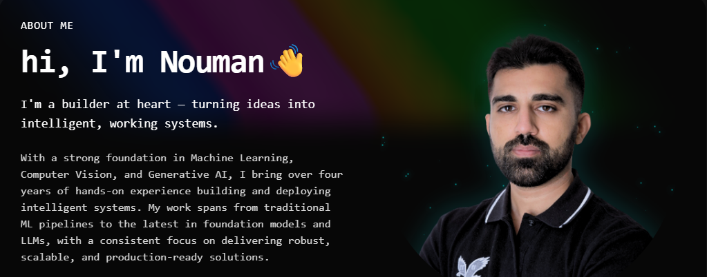

<!--Banner-->

  <em>To seamlessly connect innovation with implementation — delivering technologies that matter.</em>

<h1 align="center">🛠️ Tᴇᴄʜ Sᴛᴀᴄᴋ & 🔍 Rᴇᴄᴇɴᴛ Fᴏᴄᴜs</h1>

<picture>
  <source media="(prefers-color-scheme: dark)" srcset="./public/tech-stack.gif">
  <source media="(prefers-color-scheme: light)" srcset="./public/tech-stack.gif">
  
</picture>

<h3>🔍 Recent Focus</h3>
<ul>
  <li>Agentic AI systems & reasoning-driven tools</li>
  <li>Retrieval-Augmented Generation (RAG) pipelines</li>
  <li>Lightweight OCR (English & Arabic) for mobile & edge</li>
  <li>Vision–Language workflows for document intelligence</li>
</ul>

<h3>💡 Highlights</h3>
<ul>
  <li>🧠 Built LLM-powered data agents for conversational queries</li>
  <li>📲 Led full document scanning & OCR pipeline (backend + SDKs)</li>
  <li>✒️ Designed signature segmentation & enhancement workflows</li>
  <li>☁️ Deployed on cloud & edge (AWS, Jetson, Android)</li>
</ul>

 

<h1 align="center">🤝 Cᴏɴɴᴇᴄᴛ Wɪᴛʜ Mᴇ 🤝</h1>

  
  
  
  

<!--Banner-->
 

  

<!--Footer--> 

  

