<!--Banner-->
<!--  -->

<!-- 🚀 **Gen AI Engineer** • **Machine Learning Specialist** • **Builder at Heart** -->

> _To seamlessly connect innovation with implementation — delivering technologies that matter._

# 🛠️ Tᴇᴄʜ sᴛᴀᴄᴋ

<table width="100%">
  <tr>
    <td width="50%" align="center">      
      
    </td>
    <td width="50%" valign="top">
      

        <h3>🔍 Recent Focus</h3>
        <ul>
          <li>Agentic AI systems</li>
          <li>Retrieval-Augmented Generation (RAG)</li>
          <li>Lightweight OCR for mobile & edge</li>
          <li>Vision–Language workflows for document intelligence</li>
        </ul>
        <h3>💡 A few quick hits:</h3>
        <ul>
          <li>🧠 Built LLM-based data agents for conversational query</li>
          <li>📲 Led full document scanning + OCR stack (backend + offline SDKs)</li>
          <li>📝 Trained OCR (English & Arabic) for edge devices</li>
          <li>✒️ Signature segmentation/enhancement pipelines</li>
          <li>☁️ Cloud & edge deployment: AWS, Jetson, Android</li>
        </ul>
      

    </td>
  </tr>
</table>
 

## 🤝 Cᴏɴɴᴇᴄᴛ Wɪᴛʜ Mᴇ 🤝

<!--Banner-->
 

<!--Footer--> 

  

